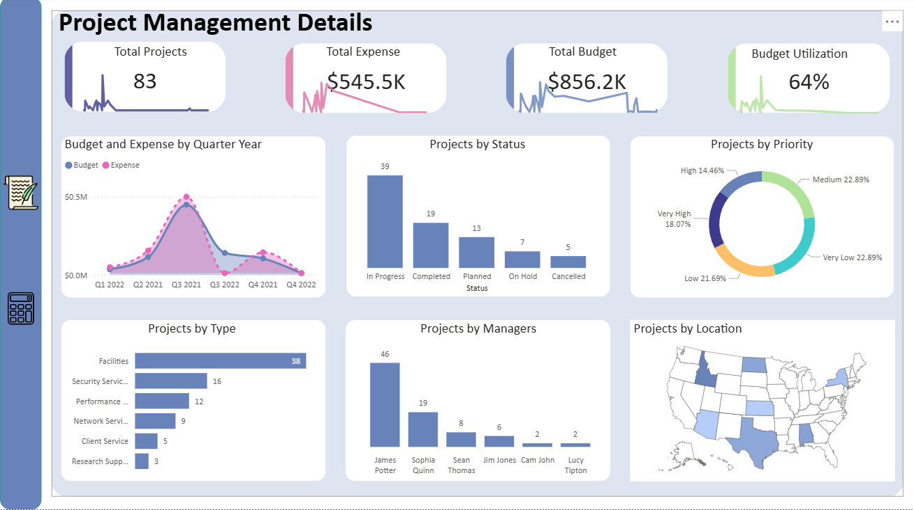

# 🗂 Project Management Dashboard - Power BI

This project is an **interactive Power BI dashboard** designed to track and analyze **project portfolio performance**.  
The dashboard provides insights into **project count, expenses, budget utilization, project status, priorities, managers, and locations**.

---

## 📌 Key Metrics (KPI Cards)
- **Total Projects**: 83  
- **Total Expense**: $545.5K  
- **Total Budget**: $856.2K  
- **Budget Utilization**: 64%  

---

## 📊 Visuals & Insights

### 1. **Budget and Expense by Quarter**
- Line chart comparing **budget vs. expense** over time (Q1 2022 – Q4 2022).  
- Highlights overspending peaks in **Q2–Q3 2021** with expenses exceeding $0.5M.  

### 2. **Projects by Status**
- Bar chart distribution:
  - In Progress: 39  
  - Completed: 19  
  - Planned: 13  
  - On Hold: 7  
  - Cancelled: 5  

### 3. **Projects by Priority**
- Donut chart with % distribution:
  - Medium: 22.89%  
  - Very Low: 22.89%  
  - Low: 21.69%  
  - Very High: 18.07%  
  - High: 14.46%  

### 4. **Projects by Type**
- Bar chart showing project categories:
  - Facilities → 38  
  - Security Services → 16  
  - Performance → 12  
  - Network Services → 9  
  - Client Service → 5  
  - Research Support → 3  

### 5. **Projects by Managers**
- Ranking of managers by project ownership:
  - James Potter → 46  
  - Sophia Quinn → 19  
  - Sean Thomas → 8  
  - Jim Jones → 6  
  - Cam John → 2  
  - Lucy Tipton → 2  

### 6. **Projects by Location**
- Interactive **U.S. map** highlighting project distribution by state.  

---

## 🛠 Tools & Technologies
- **Power BI Desktop**  
- Data modeling & transformation in **Power Query**  
- DAX calculations for:
  - Budget utilization %  
  - Expense vs. Budget variance  
  - Project distribution metrics  
- Visuals: KPI cards, bar charts, donut chart, line chart, map  

---

## 🚀 How to Use
1. Open the `.pbix` file in **Power BI Desktop**.  
2. Explore dashboards for:
   - Budget vs. Expense over time  
   - Project completion status  
   - Priority distribution  
   - Manager and type performance  
   - Regional project allocation  
3. Apply filters to drill down into specific projects or categories.  

---

## 📌 Insights from Dashboard
- **64% budget utilization** indicates room for efficiency improvement.  
- **Most projects are still in progress (39/83)**, with only 19 completed.  
- **Facilities projects dominate** (38), taking a large portion of resources.  
- **James Potter** manages the majority of projects (46), showing workload imbalance.  
- Project distribution is **concentrated in specific U.S. states**, helping identify regional focus.  

---

## 📷 Screenshot

---

## 📂 Project Files
- `Project_Management_Report.SS.png` → Dashboard Screenshot  
- `Project_Management.pbix` → Power BI file (if shared)  

---

## ✨ Author
Created by **[Your Name]**  
Power BI | Data Analytics | Project Management
